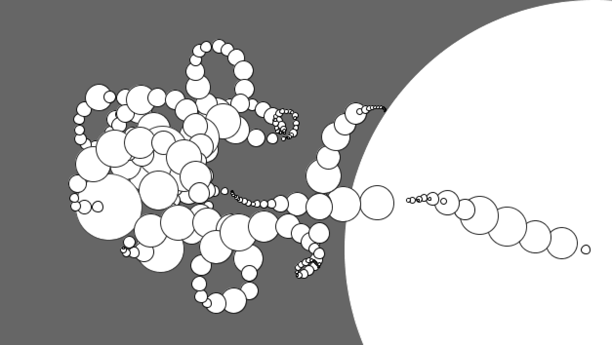
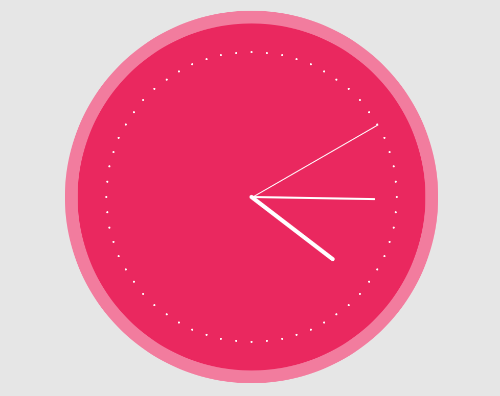
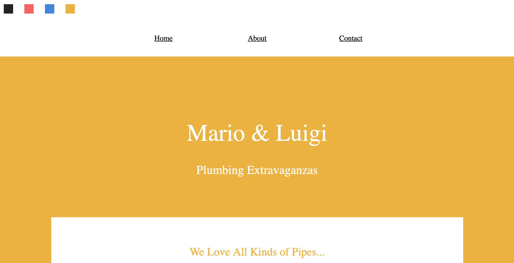

# Fun-Mini-Projects

Fun interactive processing sketches or simple html/css/js tricks mostly based on "the coding train" or "coding ninja" tutorials on YouTube. 

In wonderful circles we have: 

In clock we make this functioning clock: 

In swatches, we learn how to change the color of components as the user wished by just clicking on the color up there:D 

and much more! so what are you still doing here? go check 'em out!